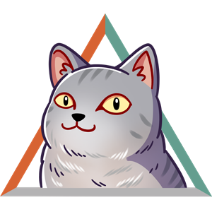

# [SDF02] Challenge: CS Cat HTML Portfolio  
<!DOCTYPE html>
<html lang="en">
<html>
<head>
<meta charset="UTF-8">
<meta name="viewport" content="width=device-width,initial-scale=1.0> 

<title>CodeSpace Cat's Portfolio🍕</title>
</head>
<body>

<nav>
  <ul>    
    <li><a href="#about">About me🔥</a></li>
    <li><a href=#skills">Skills⚒</a></li>
    <li><a href=#Portfolio">Portfolio📷</a></li>
    <li><a href="#Contact">Contact🤙</a></li>
  <ul>
<nav>

<section id="about">
    <h2>About Me 🐱</h2>
    

    
Hello i'm <strong> CodeSpace Cat</strong>. I'm purr-ssionate about web development and design.Ive been pawing at the web industry for just one catnap (thats less than a day in human terms), and I adore crafting pawsitetively intuitive, whisker-twitching,and fur-tastic web experiences.Whoa, thats a lot of puns.🐾

